# project_rental_mobil
# 🚗 Sistem Informasi Rental Mobil (PHP Native MVC)

**Project UAS Pemrograman Web** 
**Nama:** M. Ridho Febrian 
**NIm:** 312410500
**Program Studi:** Teknik Informatika  
**Universitas:** Universitas Pelita Bangsa  

---

## 📖 Deskripsi Project

Ini adalah aplikasi berbasis web yang saya kembangkan untuk mempermudah proses penyewaan mobil. Aplikasi ini dibangun menggunakan **PHP Native** (tanpa framework) namun tetap menerapkan konsep arsitektur **MVC (Model-View-Controller)** agar kode lebih rapi, terstruktur, dan mudah dikembangkan.

Saya juga mengimplementasikan **Routing Manual** menggunakan `.htaccess` untuk menciptakan URL yang bersih (*Pretty URL*), sehingga aplikasi terlihat lebih profesional layaknya menggunakan framework modern.

---

## 🛠️ Teknologi yang Digunakan

Dalam pengembangan aplikasi ini, saya menggunakan stack teknologi berikut:

* **Backend:** PHP 8.0+ (OOP Style)
* **Database:** MySQL / 
* **Frontend:** HTML5, CSS3, Bootstrap 5.3 (Responsif)
* **Javascript:** Vanilla JS & SweetAlert2 (untuk interaksi UI yang menarik)
* **Styling:** Google Fonts (Poppins) & Bootstrap Icons

---

## 📂 Struktur Direktori & Penjelasan File

Berikut adalah struktur folder yang saya rancang untuk memisahkan logika (Controller), tampilan (View), dan konfigurasi:

```text
rental_mobil/
│
├── 📁 app/                     # Inti logika aplikasi (MVC)
│   ├── 📁 Controllers/         # Otak aplikasi (menghubungkan Database & View)
│   │   ├── AuthController.php  # Menangani Login & Logout session
│   │   └── MobilController.php # Menangani CRUD Mobil, Pagination, & Pencarian
│   │
│   └── 📁 Views/               # Antarmuka pengguna (Tampilan HTML)
│       ├── dashboard.php       # Halaman Admin (Tabel Manajemen)
│       ├── edit_mobil.php      # Form Edit data
│       ├── home.php            # Landing Page Utama (Modern UI)
│       ├── katalog.php         # Halaman List Mobil untuk User
│       ├── login.php           # Halaman Login (Admin & User)
│       └── tambah_mobil.php    # Form Tambah Mobil Baru
│
├── 📁 config/                  # Konfigurasi Database
│   └── Database.php            # Koneksi ke MySQL menggunakan PDO
│
├── 📁 public/                  # Aset statis yang diakses publik
│   ├── 📁 css/
│   │   └── style.css           # Custom CSS (Glassmorphism, Gradient, dll)
│   ├── 📁 img/                 # Tempat penyimpanan foto mobil (Upload)
│   └── 📁 js/
│       └── script.js           # Logika JS (SweetAlert, Konfirmasi Hapus/Logout)
│
├── .htaccess                   # Konfigurasi Apache (Pretty URL & Routing)
├── index.php                   # Entry Point (Gerbang Utama / Router)
├── rental_mobil.sql            # File Database untuk di-import
└── README.md                   # Dokumentasi Project
```

---

## 🔍 Penjelasan Alur Logika (Routing)

  * Saya tidak mengakses file .php secara langsung di browser (contoh: katalog.php). Sebagai gantinya, saya menggunakan teknik Routing di index.php.

  * Semua request URL diarahkan ke index.php oleh .htaccess.

  * index.php mengecek URL yang diminta (misal: /katalog atau /dashboard).

  * Switch-case di index.php memanggil Controller dan View yang sesuai.

  * Ini membuat keamanan lebih terjaga karena struktur file asli tersembunyi.
---

## ✨ Fitur & Fungsionalitas

## 1. Hak Akses (Multi-Role)
   
  * Sistem membedakan sesi antara Admin dan User Biasa.

    * **Jika Admin login** -> Diarahkan ke Dashboard (Bisa Edit/Hapus).

    * **Jika User login** -> Diarahkan ke Katalog (Hanya bisa lihat & sewa).

## 2. Fitur Admin (Back-Office)

**Dashboard Modern: Menampilkan tabel data mobil dengan desain Card**.

* CRUD Mobil:

    * **Create**: Upload foto mobil, input merk, model, nopol, harga.

    * **Read**: Melihat daftar armada.

    * **Update**: Mengedit info mobil & mengganti foto lama.

    * **Delete**: Menghapus data dengan konfirmasi Pop-up (SweetAlert).

    * **Status Control**: Mengubah status mobil menjadi "Tersedia" atau "Disewa".

## 3. Fitur User (Front-Office)

* Landing Page: Halaman depan dengan animasi dan informasi layanan.

  * **Katalog Interaktif**: Tampilan Grid mobil yang responsif.

  * **Pencarian (Search)**: Mencari mobil berdasarkan Merk atau Model secara real-time (reload).

  * **Pagination**: Membagi halaman jika data mobil terlalu banyak.

  * **Logout Aman**: Konfirmasi logout dengan pop-up interaktif
 
## 🚀 Panduan Instalasi (Cara Menjalankan)

Jika Bapak/Ibu ingin menjalankan project ini di komputer lokal, silakan ikuti langkah berikut:
```
  1. Siapkan Environment:

  2. Pastikan XAMPP (Apache & MySQL) sudah berjalan.

  3. Simpan folder project rental_mobil di dalam htdocs.

  1. Konfigurasi Database:
     
    2. Buka localhost/phpmyadmin.

    3. Buat database baru bernama: rental_mobil.

Import file rental_mobil.sql yang ada di folder project ini.

Cek Koneksi:

  Buka file config/Database.php.

  Pastikan username (root) dan password (kosong) sesuai dengan settingan XAMPP.

Akses Browser:

Buka URL: http://localhost/rental_mobil
```
---

## 🔐 Akun Login (Testing)
| Role | Username |  password |
| :--- | :--- | :--- |
| **Administrator** | **admin** | **password** |
| **User / Penyewa** | **user**  | **password**  |


## 📸 Daftar Screenshot 


## 1. Bagian Awal: Landing Page & Database
   
**Screenshot Home (Landing Page):**

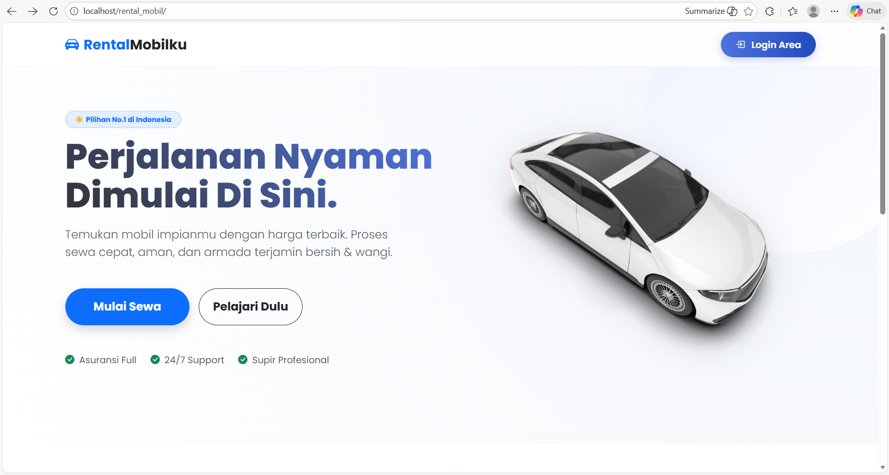   

**Screenshot Struktur Database (phpMyAdmin):**

**admin**


**user**

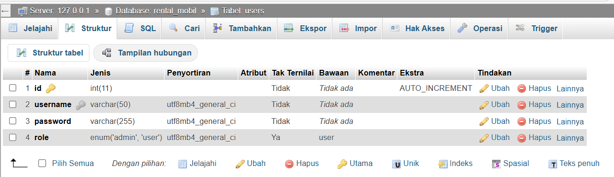

Penjelasan: Membuktikan perancangan basis data yang terorganisir dengan tipe data yang sesuai.

## 2. Bagian Autentikasi

**Screenshot Halaman Login:** 

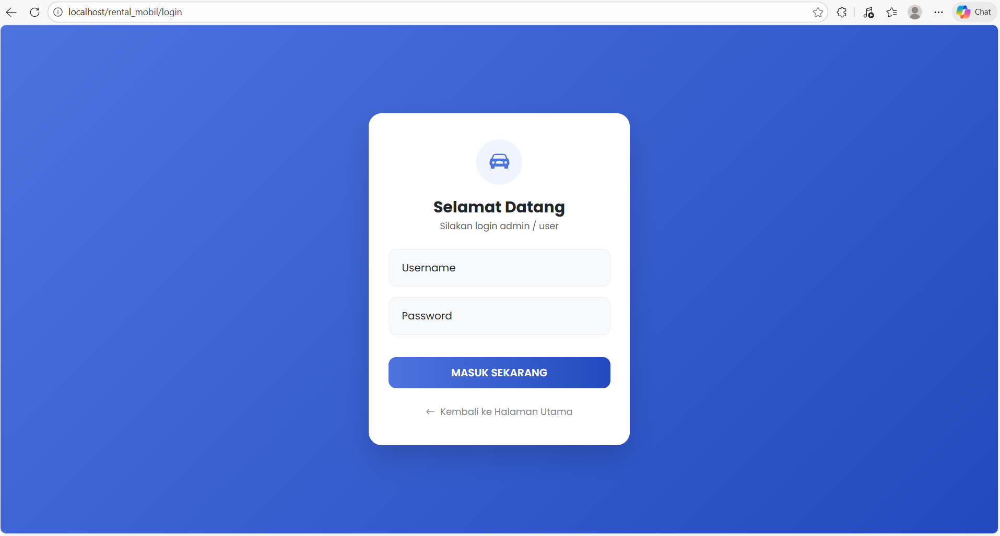

**Screenshot Pop-up Login Berhasil:** 

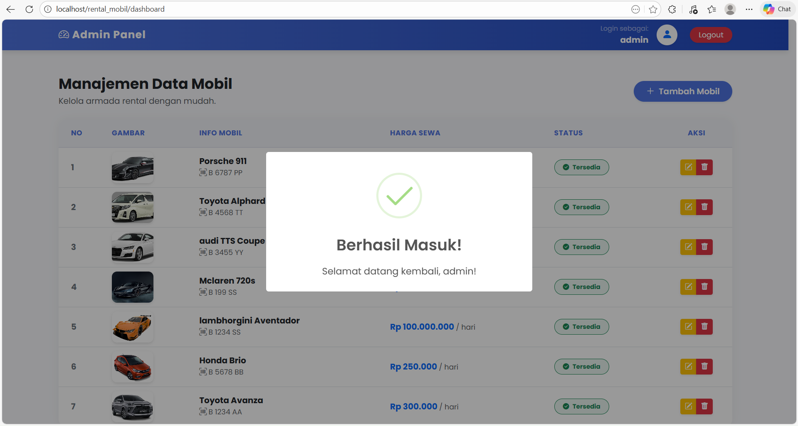

**Screenshot Pop-up Login Gagal:**

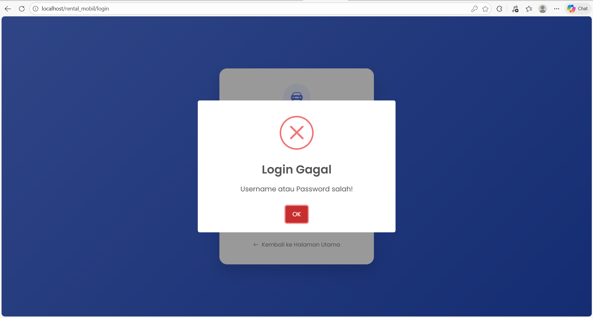

Penjelasan: Menunjukkan fitur validasi keamanan dan interaksi pengguna yang baik.

## 3. Bagian Panel Admin (Fokus CRUD)

**Screenshot Dashboard Utama:** 

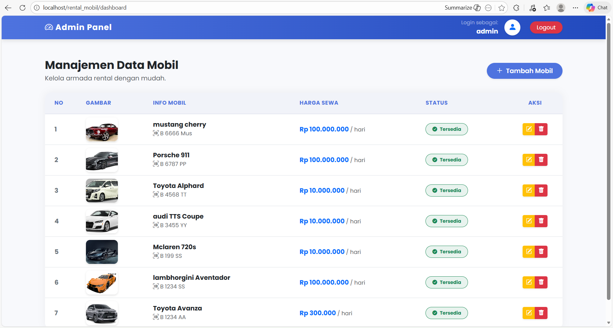

**Screenshot Form Tambah Mobil:**

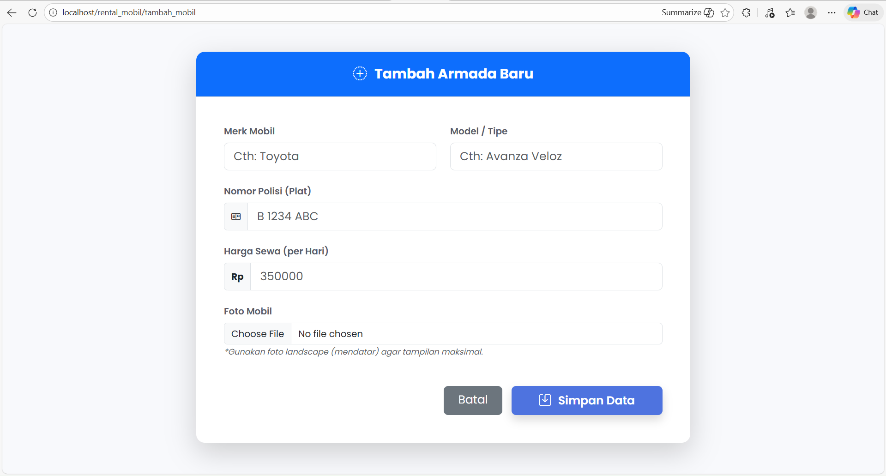

**Screenshot Form Edit Mobil:** 

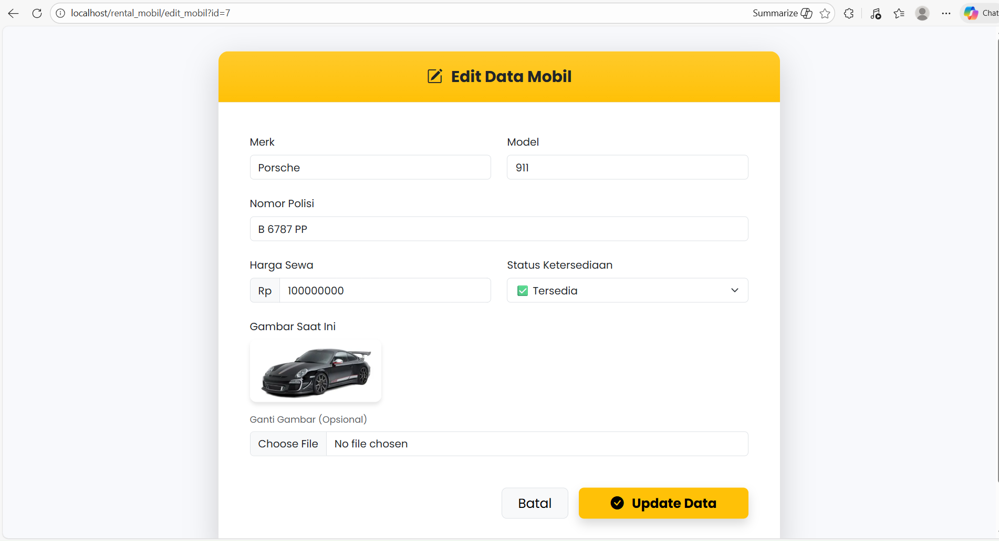

**Screenshot Konfirmasi Hapus (SweetAlert):** 

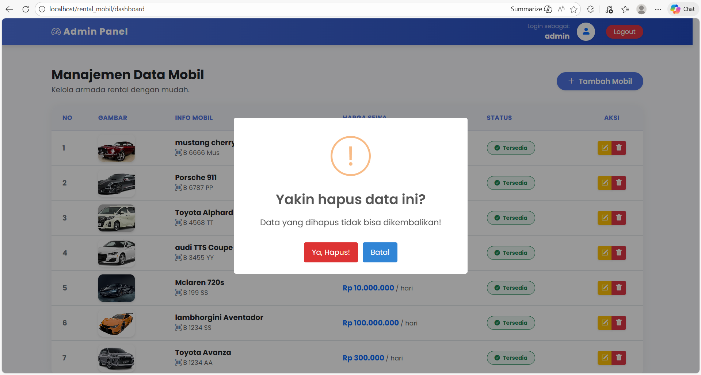

Penjelasan: Mendokumentasikan siklus hidup data (Create, Read, Update, Delete) secara lengkap.

## 4. Bagian Katalog User & Fitur Pintar

**Screenshot Katalog Mobil:** 

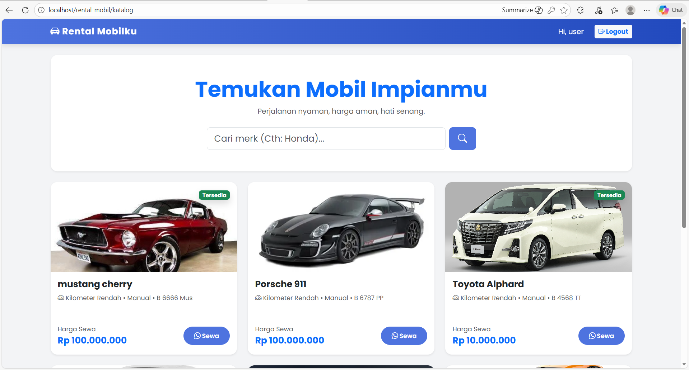

**Screenshot Fitur Pencarian:** 

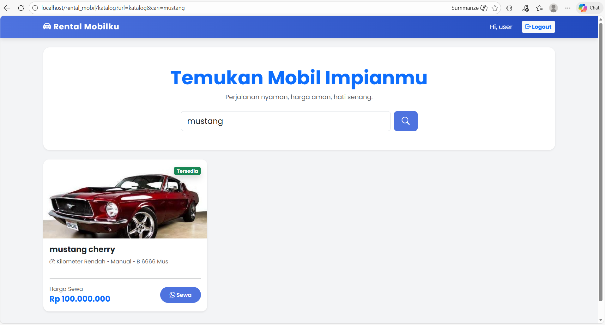

**Screenshot Fitur Pagination:**

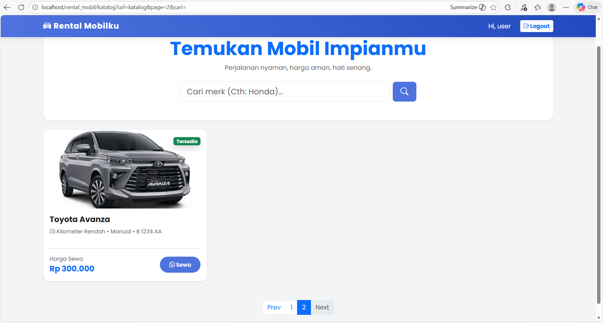

**Screenshot Klik Tombol Sewa:** 

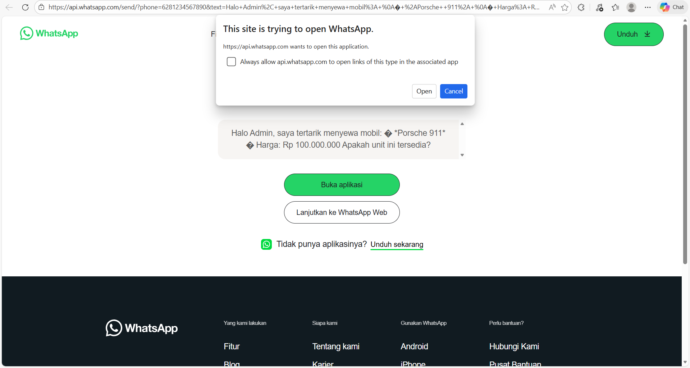

Penjelasan: Menunjukkan fungsionalitas pencarian data dan integrasi pihak ketiga (WhatsApp API).

